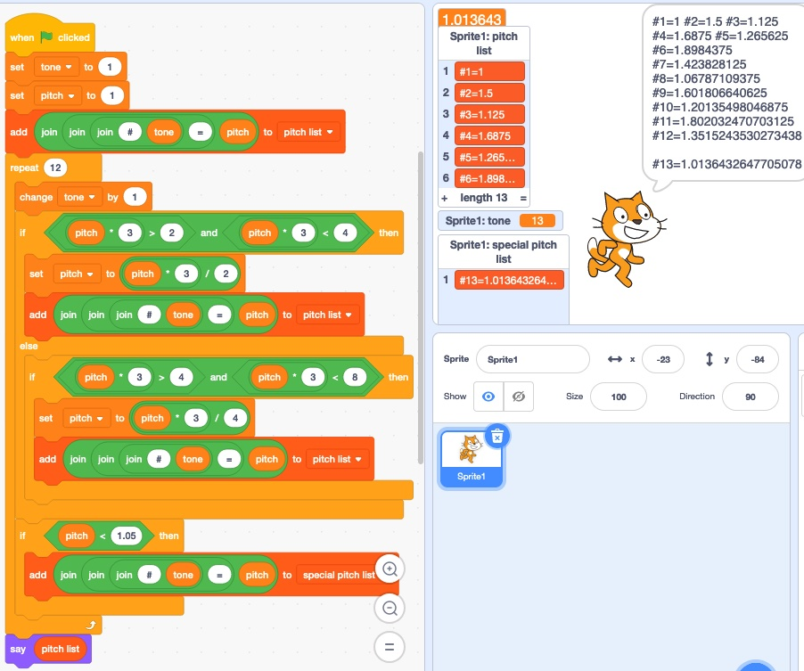

# Pythagorean tuning method

Since I play the piano, I wondered for a long time why each octave has 12 tones, not 10 nor 15. So, I learned about the [Pythagorean tuning method](https://en.wikipedia.org/wiki/Pythagorean_tuning) and implemented it with [Scratch](https://scratch.mit.edu/). See the [Scratch.org project page](https://scratch.mit.edu/projects/243436547) or find a sb3 file in the [scratch folder](scratch/).

  

